By [**Jinwoo Jeong**](https://github.com/bugoverdose),
[**Juha Lee**](https://github.com/juhajulia),
[**Yusom Jo**](https://github.com/0150362),
[**Woo-Young Ahn**](https://ccs-lab.github.io/team/young-ahn/) | September 2, 2025

<br />

**Hierarchical Gaussian Filter (HGF)** is a computational model designed to explain how individuals learn in uncertain and changing environments [@mathys2011bayesian].
Currently, [TAPAS](https://github.com/ComputationalPsychiatry) is the most widely used tool for applying HGF to behavioral data.
By offering various combinations of perceptual and observation models,
[TAPAS HGF Toolbox](https://github.com/ComputationalPsychiatry/hgf-toolbox) enabled a computationally efficient way to apply different HGF models
(also see [PyHGF](https://github.com/ComputationalPsychiatry/pyhgf), a Python-library, which supports generalized HGF models).

Here, we show how we implemented HGF in the hBayesDM `1.3.0` [@ahn2017hbayesdm].
Two new HGF models are included in the package:
[`hgf_ibrb`](../reference/hgf_ibrb.html) (for hierarchical Bayesian analysis)
and [`hgf_ibrb_single`](../reference/hgf_ibrb_single.html) (for individual Bayesian analysis).
`ibrb` refers to input = binary & response = binary.
Although these functions are currently limited to behavioral data with binary inputs and binary responses,
they provide a straightforward way to apply MCMC and (hierarchical) Bayesian analysis to HGF models,
which are currently unavailable in TAPAS.

```{r setup, include=FALSE}
knitr::opts_chunk$set(echo = TRUE)
knitr::opts_chunk$set(fig.align = "center")
```

# 1. Example Task

Let’s consider a probabilistic reversal learning task where HGF can be applied.

On each trial, participants are presented with two colored options—blue(1) and orange(0)—and choose one of the options. 
Reward contingency changes over trials (see Figure 1) and participants are instructed to maximize the cumulative reward.

```{r fig_contingency_schedule, echo=FALSE, out.width="70%", fig.cap="Figure 1. Reward contingency schedule. The y-axis shows the actual reward probability of the blue option p(reward|blue), while the x-axis shows the trial number. Note that p(reward|orange) = 1 - p(reward|blue)."}
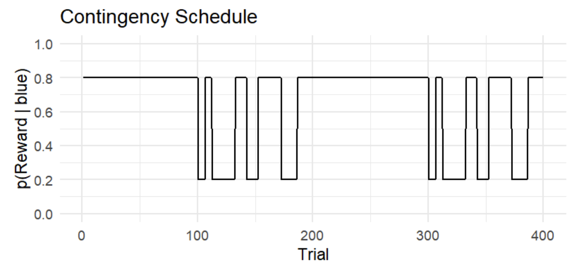
```

The figure above illustrates a contingency schedule for a restless two-armed bandit task.
The schedule spans 400 trials, alternating between stable and volatile phases.

- Stable phases (100 trials each): reward probabilities remain fixed. For example, choosing the blue option yields a reward with a probability of 80% throughout the first stable block.
- Volatile phases (100 trials each): reward probabilities switch between 20% and 80% after a random number of trials (6, 10, 14, or 20), making the environment unpredictable.

Probabilistic learning tasks like this are well suited for HGF analysis because the environment changes over time, requiring participants to continuously track shifting reward contingencies.

# 2. Understanding HGF

In this section, we briefly explain HGF (please see Mathys et al., 2011, 2014 for more details). 
One way to approach probabilistic learning tasks is to assume a “true” hidden quantity for each trial, 
such as the actual probability of receiving a reward from the chosen option. 
This hidden state changes over time according to the contingency schedule, 
but the agent cannot observe it directly. 
Instead, the agent tries to update its beliefs about the hidden state across trials based on inputs and observed feedback 
(whether the chosen option led to a reward or not). 
In this sense, the task represents a learning problem under uncertainty: 
how an agent can keep track of a changing, probabilistic world based on noisy feedback.

Note that there exist multiple sources of uncertainty: **stochasticity** (the reward is probabilistic on each trial),
**volatility** (the reward contingency changes over time),
and even **volatility of volatility** (the degree of environmental change itself may vary over time).
Successful performance on such a task therefore depends on the optimal processing of these sources of uncertainty in learning,
and the pattern of such processing can be characterized by the parameter values in HGF.

## 2.1. Model Structure

As the name suggests, the Hierarchical Gaussian Filter consists of multiple levels of hidden states,
each of which are organized in a hierarchy and evolving in Gaussian random walks.
Theoretically, the number of hierarchy levels has no upper bound,
but in practice it is not set too high due to diminishing explanatory gains and limited interpretability as a cognitive model.

```{r fig_hgf_gaussian_random_walk, echo=FALSE, out.width="70%", fig.cap="Figure 2. Overview of the Hierarchical Gaussian Filter (adopted from Mathys et al. 2014)"}
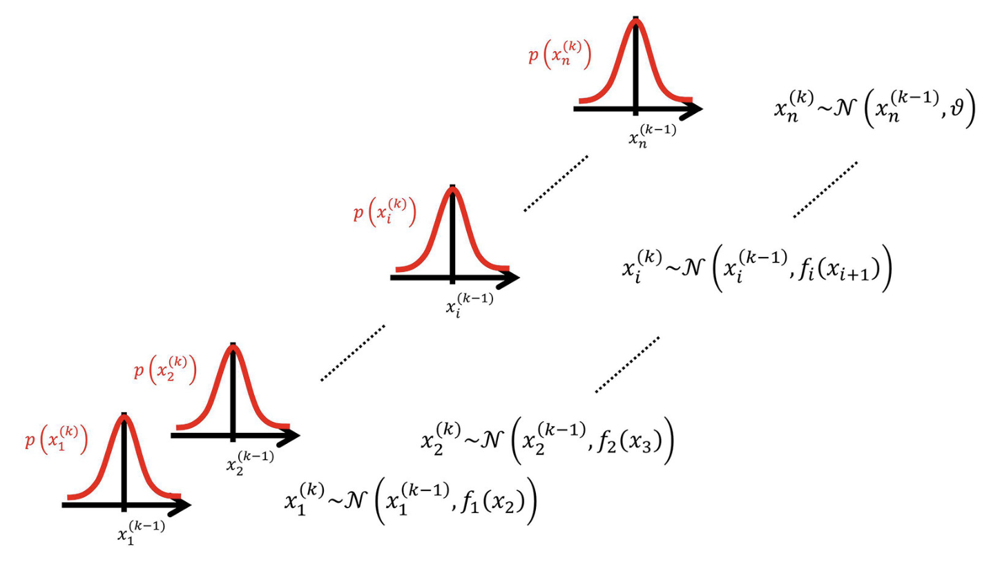
```

For instance, let's assume a 3-level HGF with binary inputs and binary responses.
An HGF model with 3 levels has three (hidden) states for each level: x₁, x₂, x₃.
And each state represents a different aspect of the environment.

- **Level 1 (x₁)** is the lowest level, representing the immediate observation or perceptual state.
  For example, in a binary task, x₁ might be the state of a cue or outcome coded as 0 or 1.
  This level does not evolve via a random walk, instead, it is generated from x₂ through an observation model (e.g., Bernoulli for binary outcomes).
  When there is no sensory noise, x₁ directly corresponds to the observed input.

- **Level 2 (x₂)** is a hidden state that represents the **current contingency of the environment** (e.g., the probability of a binary outcome).
  It can be thought of as the agent's belief about the latent factor governing level-1 events.
  This is a continuous state that drifts over time via a Gaussian random walk: 
  on each trial, x₂ changes slightly, with the variance of this change dictated by level 3 (x₃).

- **Level 3 (x₃)** is a higher-level hidden state representing the **volatility of the environment**, namely how rapidly x₂ changes.
  Although x₃ is modeled as a Gaussian random walk, the variance of this random walk is determined by a constant parameter because there is no higher level to modulate it.
  Intuitively, when x₃ is high, the agent believes the environment is changing rapidly and therefore updates x₂ more strongly;
  when x₃ is low, the agent assumes stability and updates x₂ more conservatively.

```{r fig_hgf_levels, echo=FALSE, out.width="70%", fig.cap="Figure 3. Overview of the hierarchical generative model (Mathys et al. 2011)"}
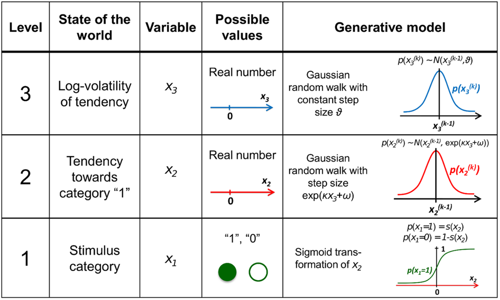
```

## 2.2. Perceptual model

In the HGF perceptual model, the parameters κ (kappa) and ω (omega) regulate the coupling and dynamics across hierarchical levels.
They encode the agent's prior assumptions about environmental uncertainty and determine how learning adapts to changing conditions.

At each level $l$, the state $x_l$ at trial $k$ evolves as a Gaussian random walk whose variance depends on κ and ω:

\begin{align*}
x_l^{(k)} &\sim N\bigl(x_l^{(k-1)} \text{, } \exp(\kappa_l x_{l+1}^{(k)} + \omega_l )\bigr), \quad l=2,...L-1 \\
\end{align*}

At the top level $L$, the variance depends only on ω:

\begin{align*}
x_L^{(k)} &\sim N\bigl(x_L^{(k-1)} \text{, } \exp(\omega_L )\bigr)
\end{align*}

### κ: phasic volatility

κ determines how strongly a lower-level state is influenced by the state above it.
Formally, it scales the effect of the higher-level value on the variance of the lower-level random walk.
In a perception model with binary inputs and $L$ hierarchical levels, κ is defined for levels 2 through $L-1$.

κ must be non-negative, and it has been suggested that an upper bound at or below 2 is sensible [@mathys2014hgf].

- When κ is too small, the lower level is almost decoupled from the higher one. 
Even if the higher-level state signals increased volatility, the learning rate at the lower level hardly changes. 
The agent ends up learning at a nearly fixed pace regardless of environmental instability.
- When κ is too large, even small changes in the higher-level state strongly alter the lower-level learning rate.
For instance, if volatility spikes, the agent immediately increases its learning rate. This makes the agent very adaptive, but it can also lead to overreacting to random noise.

### ω: tonic volatility

ω provides the baseline drift for each level's random walk.
It is the constant offset in the log-variance, setting how much the agent expects change even without higher-level modulation.
In a perception model with binary inputs and $L$ hierarchical levels, ω is defined for levels 2 through $L$.

Theoretically, ω doesn't require upper or lower bounds.
However, both [`hgf_ibrb`](../reference/hgf_ibrb.html) and [`hgf_ibrb_single`](../reference/hgf_ibrb_single.html)
require setting the appropriate range for each level of ω parameters for efficient and effective sampling.

- When ω is too low, the random walk variance is small by default.
  The agent assumes stability, so updates are slow and conservative.
  Even with repeated prediction errors, beliefs change only gradually, reflecting a tendency to cling to prior expectations.
- When ω is too high, the random walk variance is very large by default.
  The agent assumes that environmental changes are common, so it updates beliefs quickly, even in a stable environment.
  This can capture individuals' characteristics who are highly responsive or prone to “jumping to conclusions.”

## 2.3. Response model

The response model maps the agent's internal prediction onto an observable decision.
In both [`hgf_ibrb`](../reference/hgf_ibrb.html) and [`hgf_ibrb_single`](../reference/hgf_ibrb_single.html),
the unit-square sigmoid function is used to transform a predictive probability 𝑚∈[0,1] into a binary choice probability:

$$
p(y = 1) = \frac{m^{\text{ }\zeta}}{m^{\text{ }\zeta} + (1 - m)^{\zeta}}
$$

### ζ: inverse decision noise

The parameter ζ (zeta) controls the steepness of the unit-square sigmoid, regulating the stochasticity of decision-making.
ζ is defined only for level 1 and must be non-negative.

- When ζ is low, the sigmoid curve becomes shallow.
  Even strong predictions (e.g., 𝑚 = 0.8) yield only moderate choice biases, and choices remain noisy and weakly belief-driven.
- When ζ is high, the sigmoid curve becomes steep.
  Even very small deviations from 0.5 lead to near-deterministic choices, and behavior closely follows the agent's beliefs.

# 3. Tutorial on `hgf_ibrb` and `hgf_ibrb_single`

This section explains how we can actually run [`hgf_ibrb`](../reference/hgf_ibrb.html) and [`hgf_ibrb_single`](../reference/hgf_ibrb_single.html).
The examples are based on the R version of the `hBayesDM` package,
but both functions are also implemented in the Python version of the `hBayesDM` package.

## 3.1. Setup

### hBayesDM setup

Check the [Getting Started](.//getting_started.html) page to set up `hBayesDM`.

### Prepare your data

For simple tests, `hBayesDM` has example data for both [`hgf_ibrb`](../reference/hgf_ibrb.html)
and [`hgf_ibrb_single`](../reference/hgf_ibrb_single.html).

If you want to apply HGF on your own data, make sure that your file has the `.csv` or `.tsv` format and contains these four columns.

- `subjID` : unique subject identifier (integer or string)
- `trialNum` : trial index (1, 2, 3, …)
- `u` : input on that trial (0 or 1)
- `y` : subject's choice on that trial (0 or 1)

For example, the task design in [Section 1](#example-task) provides two colored options: blue coded as 1 and orange coded as 0.
In this case, a participant (`subjID = 1`) can choose the blue option (`y = 1`) at the first trial (`trialNum = 1`)
when the correct choice was actually the orange option (`u = 1`).
No other information (e.g., `feedback` column indicating whether the subject got the reward or not) is needed in the HGF model.

## 3.2. Fitting with default settings

Now, we will share various ways we can fit [`hgf_ibrb`](../reference/hgf_ibrb.html)
and [`hgf_ibrb_single`](../reference/hgf_ibrb_single.html) on the example data.

Below is the simplest way to run [`hgf_ibrb`](../reference/hgf_ibrb.html) on a dataset with multiple participants.
The command below initiates an MCMC procedure of 4 MCMC chains,
each consisting of 5 burn-in (warm-up) iterations followed by 5 sampling iterations.

```{r, eval = FALSE}
fit <- hgf_ibrb(data = "example", niter = 1000, nwarmup = 500, nchain = 4)
```

The above command is the same as the commands below because unspecified arguments fall back to their default values.
By default, [`hgf_ibrb`](../reference/hgf_ibrb.html) fits a 3-level HGF model (`L = 3`).
The `kappa_lower` and `kappa_upper` arguments are one-element vectors that bound κ₂,
whereas `omega_lower` and `omega_upper` are two-element vectors that bound ω₂ and ω₃.
In contrast, `zeta_lower` and `zeta_upper` are scalars, since there is only a single ζ regardless of the hierarchy depth.

```{r, eval = FALSE}
fit <- hgf_ibrb(
  data = "example",
  niter = 1000,
  nwarmup = 500,
  nchain = 4,
  L = 3,
  input_first = FALSE,
  mu0 = c(0.5, 1.0),
  sigma0 = c(0.1, 1.0),
  kappa_lower = c(0),  
  kappa_upper = c(2),
  omega_lower = c(-10, -15), 
  omega_upper = c(0, 0),
  zeta_lower  = 0,
  zeta_upper  = 2
)
```

Below are some of the simple ways to print the overall statistics of the fitted results.

```{r, eval = FALSE}
print(summary(fit))
print(fit$allIndPars)
```
<!-- $ -->

To apply HGF to a single participant's data, you can use [`hgf_ibrb_single`](../reference/hgf_ibrb_single.html) like below.

```{r, eval = FALSE}
fit <- hgf_ibrb_single(data = "example", niter = 1000, nwarmup = 500, nchain = 4)
print(summary(fit))
print(fit$allIndPars)
```
<!-- $ -->

## 3.3. `input_first` option

The `input_first` option is to help researchers apply HGF without changing their data format.

- input_first=TRUE: for each row, participant observed the value of input `u` before choosing `y`
- input_first=FALSE: for each row, participant observed the value of input `u` after choosing `y` (default)

```{r, eval = FALSE}
fit <- hgf_ibrb(data = "example", niter = 1000, nwarmup = 500, nchain = 4, input_first=TRUE)
```

Similar features are also implemented in the observation models in TAPAS as the `predorpost` configuration.

## 3.4. Parameter boundaries

Parameter boundaries can be set for each parameter.
For example, if you want to set parameter boundaries for a 3-level HGF model as:

\begin{align*}
0 < &\text{ }\kappa < 1 \\
-10 < &\text{ }\omega_{2} < 2 \\
-15 < &\text{ }\omega_{3} < 3 \\
0 < &\text{ }\zeta < 4
\end{align*}

Then, you set the arguments below:

```{r, eval = FALSE}
fit <- hgf_ibrb(
  data = "example",
  kappa_lower = c(0),
  kappa_upper = c(1),
  omega_lower = c(-10, -15),
  omega_upper = c(2, 3),
  zeta_lower  = 0,
  zeta_upper  = 4
)
```

## 3.5. Fixing parameter values

As TAPAS provides a way to fixate a certain parameter to a fixed value,
[`hgf_ibrb`](../reference/hgf_ibrb.html) and [`hgf_ibrb_single`](../reference/hgf_ibrb_single.html) also provide a similar feature.
To set a parameter as a constant, simply set the lower bound and upper bound to the same value. Below are some examples.

The command below fixates κ value to 1, while other parameters are set as free parameters with their default boundaries.
```{r, eval = FALSE}
fit <- hgf_ibrb(data = "example", kappa_lower = c(1.0), kappa_upper = c(1.0))
```

The command below fixates ω₂ to -4, while ω₃ is still estimated with the given boundaries (-10 < ω₃ < -2).
```{r, eval = FALSE}
fit <- hgf_ibrb(data = "example", omega_lower = c(-4.0, -10.0), omega_upper = c(-4.0, -2.0))
```

In contrast, the command below fixates ω₃ to -4, while ω₂ is still to be estimated with the given boundaries (-9 < ω₂ < -1).
```{r, eval = FALSE}
fit <- hgf_ibrb(data = "example", omega_lower = c(-9.0, -4.0), omega_upper = c(-1.0, -4.0))
```

The command below fixates ζ value to 1, while other parameters are estimated with default boundaries.
```{r, eval = FALSE}
fit <- hgf_ibrb(data = "example", zeta_lower = 1.0, zeta_upper = 1.0)
```

Of course, you can fixate multiple parameters at the same time as shown below:
```{r, eval = FALSE}
fit <- hgf_ibrb(data = "example", kappa_lower = c(1.0), kappa_upper = c(1.0), zeta_lower = 1.0, zeta_upper = 1.0)
fit <- hgf_ibrb(data = "example", omega_lower = c(-6.0, -4.0), omega_upper = c(-6.0, -4.0))
```

## 3.6. `L`: level of hierarchy

`L` option can be used to specify the level of hierarchy.
The default and the minimum value is `L=3` because it is the most widely used and most interpretable.

Note that the number of parameters is automatically chosen based on the level of hierarchy.
For example, the code below will fail because the default arguments for each parameter can only be used for `L = 3`.

```{r, eval = FALSE}
fit <- hgf_ibrb(data = "example", niter = 1000, nwarmup = 500, nchain = 4, L = 4)
```

Below is an example of fitting a 4-level HGF model.
`L=4` introduces a fourth latent state (x₄) and
extends the parameterization with two couplings (κ₂, κ₃), volatilities (ω₂, ω₃, ω₄),
and initial-state vectors for levels 2-4.

```{r, eval = FALSE}
fit <- hgf_ibrb(
  data = "example",
  niter = 1000,
  nwarmup = 500,
  nchain = 4,
  L = 4,
  kappa_lower = c(0.0, 0.0),
  kappa_upper = c(3.0, 3.0),
  omega_lower = c(-9.0, -10.0, -12.0),
  omega_upper = c(-1.0,  -2.0,  -3.0),
  mu0    = c(0.0, 1.0, 1.0),
  sigma0 = c(0.1, 1.0, 1.0),
  zeta_lower  = 0.03,
  zeta_upper  = 5.0
)
```

# 4. Parameter Recovery

In order to ensure that the estimated parameters genuinely reflect the underlying generative process,
parameter recovery analysis was conducted to validate parameter identifiability and estimation reliability.
This procedure involves generating synthetic datasets from known parameter values and then
re-estimating those parameters using the same model [@ahn2011model, @heathcote2015goodpractices, @wilson2019tenrules].

## 4.1. Simulation

In order to simulate binary inputs, the contingency schedule from [Section 1](#example-task) was used to create 400 trials of inputs.
To simulate binary responses, `tapas_simModel` function from TAPAS HGF Toolbox was applied to the simulated inputs, assuming 3-level HGF with binary responses.
A total of 30 participants' behavioral datasets were generated using randomly chosen parameter combinations:

\begin{align*}
\kappa &= 1.0 \\
-9.0 \leq &\text{ }\omega_{2} \leq -1.0 \\
-10.0 \leq &\text{ }\omega_{3} \leq -2.0 \\
0.03 \leq &\text{ }\zeta \leq 4.0
\end{align*}

Note that κ is fixed to 1, following many of the previous works with similar context [@tecilla2023modulation; @hein2021state].

## 4.2. Recovery with TAPAS

In order to check whether the simulated data had reasonable parameter ranges that HGF models can recover, 
`tapas_fitModel` function from TAPAS HGF Toolbox was applied to check parameter recovery.
`tapas_hgf_binary` and `tapas_unitsq_sgm` models were applied using the following prior settings:

\begin{align*}
\mu_{0,2} &= 0, \quad \mu_{0,3} = 1 \\
\sigma^{2}_{0,2} &= 1, \quad \sigma^{2}_{0,3} = 1 \\
\omega_{2} &\sim N(-5, 4^2) \\
\omega_{3} &\sim N(-6, 4^2)
\end{align*}

Figure 4 shows that both ω₂ and ζ were recovered extremely well (ω₂: r = 0.99, p < 1.63e-23; ζ: r = 0.99, p < 8.9e-26), 
indicating that these parameters can be reliably estimated at the individual level.
In contrast, ω₃ exhibited exhibited poor parameter recovery (r = -0.09, p = 0.633),
with all the estimated values presumably stuck in a local minima near -6.

```{r fig_tapas_recovery, echo=FALSE, out.width="90%", fig.cap="Figure 4. Parameter recovery with TAPAS. Posterior means of the estimated parameters."}
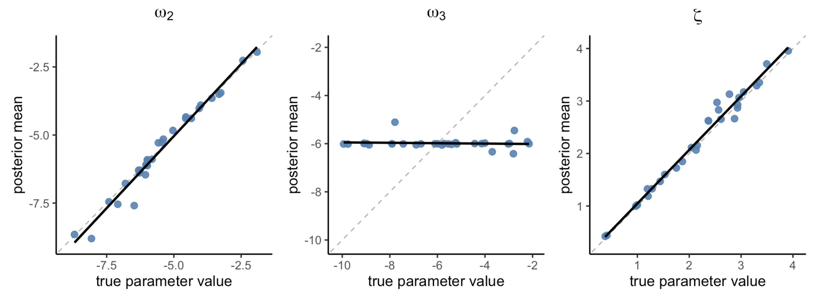
```

## 4.3. Recovery with `hgf_ibrb_single`

For each subject's data, [`hgf_ibrb_single`](../reference/hgf_ibrb_single.html) was applied in a loop with settings like below.

```{r hgf_ibrb_single, eval=FALSE}
fit <- hgf_ibrb_single(data = subject_data,
                       niter = 3000,
                       nwarmup = 1500,
                       nchain = 4,
                       L = 3,
                       kappa_lower = c(1.0),
                       kappa_upper = c(1.0),
                       omega_lower = c(-9.0, -10.0),
                       omega_upper = c(-1.0, -2.0),
                       zeta_lower  = 0.03,
                       zeta_upper  = 4.0,
                       mu0 = c(0.0, 1.0),
                       inits = "random"
)
```

```{r fig_individual_recovery, echo=FALSE, out.width="90%", fig.cap="Figure 5. Parameter recovery with hBayesDM (hgf_ibrb_single, individual Bayesian analysis)"}
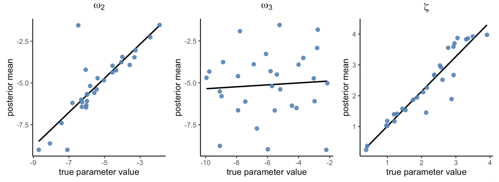
```

Figure 5 shows that both ω₂ and ζ were recovered pretty well (ω₂: r = 0.90, p < 2.51e-11;  ζ: r = 0.95, p < 7.81e-16).
In contrast, ω₃ showed poor parameter recovery (r = 0.03, p = 0.892).

```{r fig_tapas_individual_recovery, echo=FALSE, out.width="90%", fig.cap="Figure 6. TAPAS vs hgf_ibrb_single"}
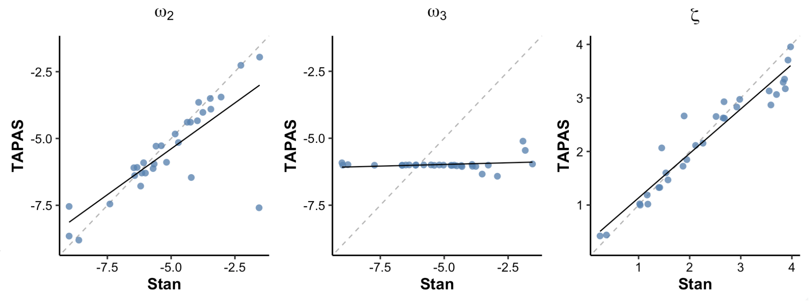
```

In Figure 6, we compared TAPAS and `hBayesDM` (individual-level) parameter estimates.
The figure shows that ω₂ and ζ parameter estimates of `hBayesDM` and TAPAS are highly correlated with each other.
In contrast, ω₃ estimates are not, but the comparison may be meaningless considering
that both approches failed to show good parameter recovery of ω₃.

Overall, these results suggest that we can use `hBayesDM` for individual level analysis,
which yields similar parameter estimates from using TAPAS.
At the same time, `hBayesDM` yields posterior distributions instead of points estimates,
which provide additional information about the parameters. 

## 4.4. Recovery with `hgf_ibrb`

For hierarchical Bayesian analysis, we applied [`hgf_ibrb`](../reference/hgf_ibrb.html) to the data from 30 participants like below:

```{r hgf_ibrb, eval=FALSE}
output <- hgf_ibrb(
  data = data,
  niter = 3000,
  nwarmup = 1500,
  nchain = 4,
  L = 3,
  kappa_lower = c(1.0),
  kappa_upper = c(1.0),
  omega_lower = c(-9.0, -10.0), 
  omega_upper = c(-1.0, -2.0),
  zeta_lower  = 0.03,
  zeta_upper  = 4.0,
  mu0   = c(0.0, 1.0),
  inits = "random"
)
```

```{r fig_hierarchical_recovery, echo=FALSE, out.width="90%", fig.cap="Figure 7. Parameter recovery with hBayesDM (hgf_ibrb, hierarchical Bayesian analysis)"}
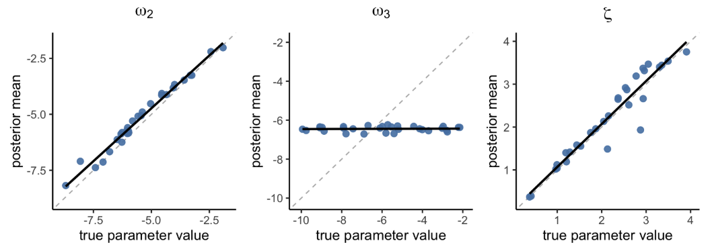
```

Figure 7 shows that both ω₂ and ζ showed excellent parameter recovery (ω₂: r = 0.99, p < 1.27e-26; ζ: r = 0.95, p < 2.62e-16),
with better correlation compared to `hgf_ibrb_single`.
Unfortunately, ω₃ still showed poor recovery (r = 0.06, p = 0.767),
but was slightly better than TAPAS considering that the results from TAPAS had a negative correlation.

```{r fig_tapas_hierarchical_recovery, echo=FALSE, out.width="90%", fig.cap="Figure 8. TAPAS vs hgf_ibrb"}
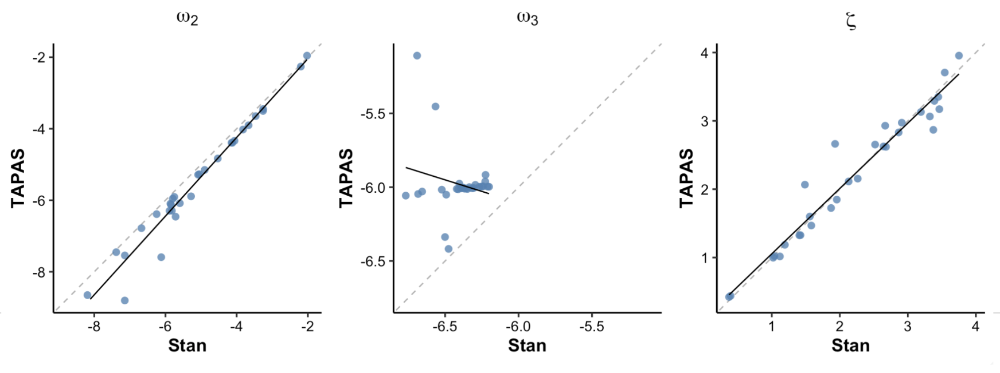
```

In Figure 8, we compared TAPAS and hBayesDM (hierarchical Bayesian) parameter estimates.
Figure 8 shows that ω₂ and ζ parameter estimates of hBayesDM and TAPAS are highly correlated with each other.
Once again, ω₃ estimates of the two appraoches are not correlated with each other.

```{r fig_hierarchical_analysis, echo=FALSE, out.width="80%", fig.cap="Figure 9. Parameter recovery"}
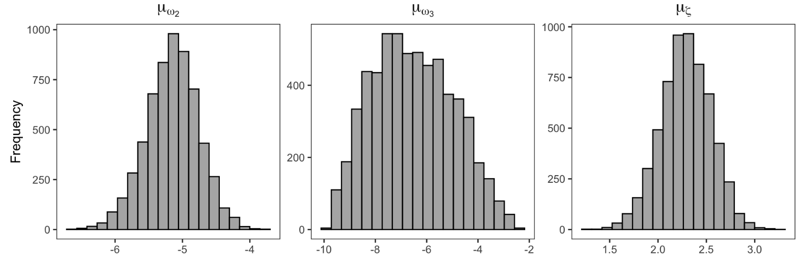
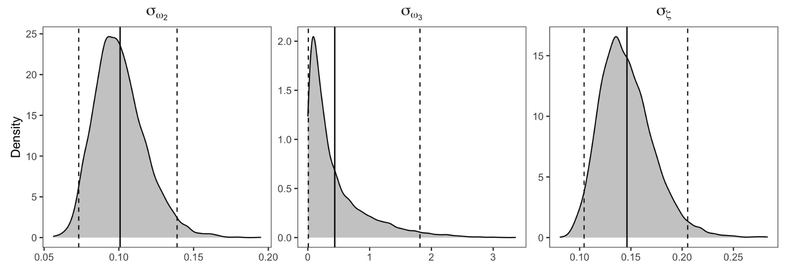
```

Figure 9 shows the posterior distributions for group-level parameters (group means and SDs) for ω₂, ω₃, and ζ,
which is an advantage of using MCMC for parameter estimation. 

Overall, we conclude hBayesDM provides a user-friendly way of fitting HGF models whose parameter estimates will be compatible with those from TAPAS.
In many cases, [`hgf_ibrb`](../reference/hgf_ibrb.html) should be preferred over [`hgf_ibrb_single`](../reference/hgf_ibrb_single.html)
as hierarchical modeling framework further improves parameter recovery compared to individual-level fits,
presumably due to the benefits of shrinkage [@ahn2011model, @kruschke2014doing].

# 5. Appendix

## 5.1. Specifying initial values

`hBayesDM` provides various options for setting the initial values (`inits`) of the parameters.
The default setting is `vb`, therefore `hBayesDM` will try to fit the model with [vb](https://mc-stan.org/rstan/reference/stanmodel-method-vb.html)
and then use the VB estimation as initial values for MCMC sampling. 
If this VB estimation fails, `hBayesDM` defaults to using random initial values instead.

Since the `vb` option has the issue of failing stochastically,
consider using the `random` option or specifying the initial parameter values,
like other models implemented in hBayesDM.

```{r init2, eval = FALSE}
fit <- hgf_ibrb(data = "example", inits = "random")
```

## 5.2. Poor recovery of ω₃

In [Section 4](#parameter-recovery), we showed that both TAPAS and hBayesDM have failed to recover ω₃ properly. 
In fact, several previous studies have also reported unreliable parameter estimation for ω₃ [@reed2020paranoia; @hein2021state; @tecilla2023modulation].
To our knowledge, there has been no systematic analysis of the causes or the potential solutions.
Therefore, we tried various input designs and parameter settings to investigate under what conditions 
we can achieve decent parameter recovery and ω₃ can produce detectable behavioral differences.

The main issue with the data used in [Section 4](#parameter-recovery) was that the individual differences in ω₃ 
didn't produce any meaningful differences in the responses between the participants.
Thus, we conducted parameter recovery analyses multiple times using various input designs and different ranges of ω₃ (-6.4 < ω₃ < -0.8) while fixing all other parameters.
Most promising results were found when we simply added more volatility to the environment using the contingency schedule shown in Figure 10.

```{r fig_contingency_schedule_om3, echo=FALSE, out.width="70%", fig.cap="Figure 10. Volatile Contingency Schedule"}
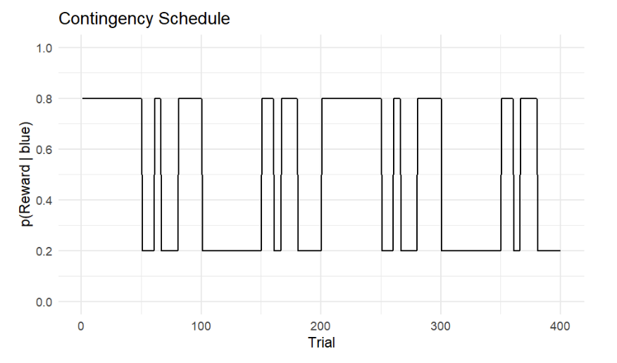
```

The overall task design is similar to the Contingency Schedule reported in [Section 1](#example-task).
The total number of trials is 400 and switches between stable and volatile phases.
The main difference is that number of trials for each stable and volatile phase is 50 trials each,
half the number of trials used in the previous design.
This leads to twice the number of shifts between stable and volatile phases compared to the previous design.

```{r fig_om3_individual_recovery, echo=FALSE, out.width="40%", fig.show="hold", fig.cap="Figure 11. Parameter recovery"}
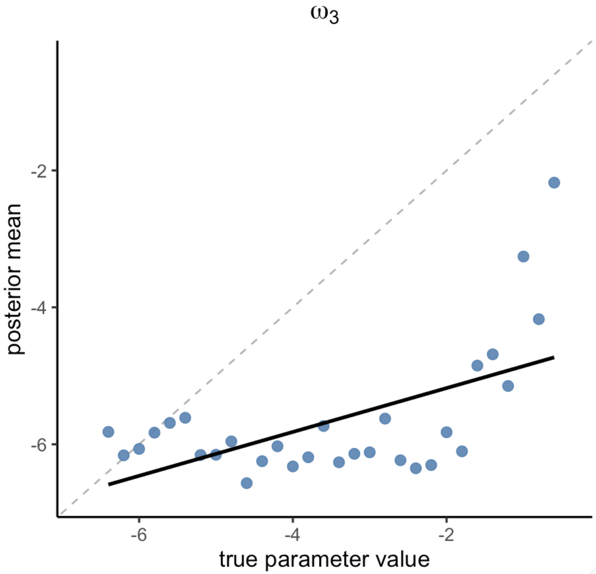
```

Figure 11 shows the result of parameter recovery of ω₃ using [`hgf_ibrb_single`](../reference/hgf_ibrb_single.html).
Although the results are not perfect,
we can see that the parameter recovery results have improved compared to the results from the previous design (Figure 5).
This indicates that adding enough volatility to the environment itself is a necessary step for
capturing the individual differences in parameters at high levels such as ω₃.

## 5.3. Estimating parameters at high levels

Many studies have reported issues in estimating parameters at level 3 or above such as ω₃ [@reed2020paranoia; @hein2021state; @tecilla2023modulation].
Below are some tips to mitigate such issues.

- **Task design**: As mentioned in the [previous section](#poor-recovery-of-ω₃),
  the researcher must carefully design their experiment and check whether their task
  can appropriately capture the individual differences in the parameters of interest.
  Simulating experiment data and running parameter recovery before actually conducting the experiment
  would be the best way to check the task design.

- **Parameter Boundaries**: Setting appropriate parameter boundaries is a crucial part of applying HGF.
  For instance, if ω₃ is too low, then exp(ω₃) becomes very small (e.g., ω₃ = -8, exp(ω₃) ≈ 0.000335),
  which means that level-3 updating has almost no influence on the agent's behavior.

# References
