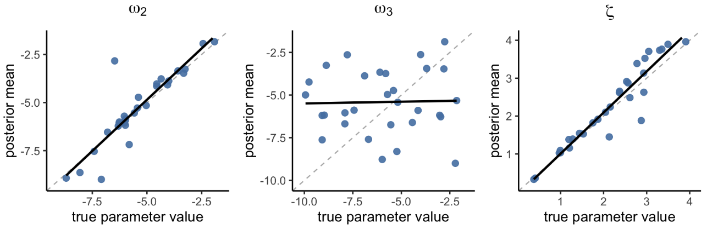

```{r setup, include=FALSE}
knitr::opts_chunk$set(echo = TRUE)
knitr::opts_chunk$set(fig.align = "center")
```

# 1. What is HGF? 
The **Hierarchical Gaussian Filter (HGF)** is a Bayesian learning model that describes how an individual learns from uncertain, changing environments. It is called “hierarchical” because it posits multiple layers (levels) of hidden states, each representing a different aspect of the environment. In the 3-level HGF (Mathys et al. 2011), there are three latent states denoted x₁, x₂, x₃, organized in a hierarchy. The generative model assumes that all hidden states except the first level evolve as Gaussian random walks, i.e., each state drifts randomly over time. Importantly, the step-size (variance) of each level’s random walk is controlled by the next higher level. In other words, the variability or volatility at level i is determined by the state value of level i+1. This coupling allows higher levels to modulate the lower-level learning rate based on estimated uncertainty.

**Level 1 (x₁)** is the lowest level, typically representing the immediate observation or perceptual state. For example, in a binary task, x₁ might be the state of a cue or outcome coded as 0 or 1, while in a continuous task, x₁ could reflect a graded measurement. This level does not evolve via a random walk; instead, it is generated from x₂ through an observation model (e.g., Bernoulli for binary outcomes, Gaussian for continuous outcomes). When there is no sensory noise, x₁ directly corresponds to the observed input; if there is perceptual uncertainty, a probabilistic mapping from x₂ to the observation is used.

**Level 2 (x₂)** is a hidden state that represents the current contingency of the environment – for example, the underlying tendency or rate (such as the probability of a binary outcome, or the mean of a continuous input). It can be thought of as the agent’s belief about the latent factor governing level-1 events. This state is unbounded (continuous) and drifts over time. In the HGF, x₂is modeled as a Gaussian random walk: on each trial, x₂ changes slightly, with the variance of this change dictated by level 3 (x₃). Thus, level 2 captures the agent’s estimate of a changing probability or mean reward value, and its fluctuations reflect ongoing belief updates.

**Level 3 (x₃)** is a higher-level hidden state representing the volatility of the environment – essentially, how rapidly or unpredictably x₂itself changes. This is sometimes described as “meta-learning,” or learning about the learning rate. Like other hidden states, x₃ is modeled as a Gaussian random walk, since volatility may itself fluctuate over time. At the highest level of a given HGF (e.g., x₃ in a 3-level model), the variance of this random walk is determined by a constant parameter, because there is no higher level to modulate it. However, the HGF is not limited to three levels: additional layers (x₄, x₅, …) can be added, with each new level modulating the variance of the one below. Intuitively, when x₃ is high, the agent believes the environment is changing rapidly and therefore updates x₂ more strongly; when x₃ is low, the agent assumes stability and updates x₂ more conservatively.

In summary, level 1 handles immediate outcomes, level 2 encodes the current belief about the environment’s state, and level 3 encodes the uncertainty or volatility governing those changes. This hierarchical design allows the model to capture multiple forms of uncertainty – for instance, uncertainty about what the current state is (level 2) and uncertainty about whether the state might change (level 3). By stacking layers, the HGF can represent complex environments, such as an agent learning both the odds of an outcome and how those odds themselves fluctuate over time. Moreover, because the HGF framework is extensible, it can in principle be expanded to any number of hierarchical levels.

***

# 2. HGF for binary input and binary response

As the HGF is a perceptual model, the full description of an agent’s real-world behavior can be captured by combining the HGF with a response model—a function that maps the perceptual states of the agent to its contingent behaviors. In real-world settings, the inputs an agent observes and the responses the agent makes can take various forms. Inputs may be categorical (e.g., an agent observing which stimulus is rewarding in a two-armed bandit task) or continuous (e.g., an agent observing stock market prices). Similarly, responses may be categorical (e.g., an agent choosing between two stimuli) or continuous (e.g., an agent predicting stock market prices).
The functions hgf_ibrb and hgf_ibrb_single specifically address hierarchical Bayesian analysis and individual-level analysis, respectively, for circumstances where the inputs and responses of an agent take binary form. For other versions of the full model with different combinations of inputs and responses (e.g., models with continuous inputs and responses), we’re planning to extend the package to implement them in the future.


## 2.1. Perceptual model - HGF for binary input & response
A powerful aspect of the HGF is that it includes a set of parameters that govern the coupling and dynamics of the hierarchy. These parameters shape how the learning process adapts to uncertainty and can be viewed as encoding the agent’s prior assumptions about the environment. In the HGF for binary input, the key parameters are commonly denoted as κ (kappa), ω (omega)—which are associated with a specific level and function. <br><br>

### Role of each parameter 
**κ (kappa): Coupling parameter**


κ determines how strongly a lower-level state is influenced by the state above it. Formally, it scales the effect of the higher-level value on the variance of the lower-level random walk.


**Small κ values :**
When κ is small, the lower level is almost decoupled from the higher one. Even if the higher-level state signals increased volatility, the learning rate at the lower level hardly changes. The agent ends up learning at a nearly fixed pace regardless of environmental instability.

**Large κ values :**
When κ is large, even small changes in the higher-level state strongly alter the lower-level learning rate. For instance, if volatility spikes, the agent immediately increases its learning rate. This makes the agent very adaptive, but it can also lead to overreacting to random noise.

Thus, κ regulates how much higher-level uncertainty shapes lower-level learning rates:

- Low κ → rigid, volatility-insensitive learning.

- High κ → highly adaptive, volatility-sensitive learning.<br><br>

**ω (omega, omega2): Baseline variance (tonic learning rate)**

ω provides the baseline drift for each level’s random walk. It is the constant offset in the log-variance, setting how much the agent expects change even without higher-level modulation.

**More negative ω values :**
With very negative ω, the random walk variance is small by default. The agent assumes stability, so updates are slow and conservative. Even with repeated prediction errors, beliefs change only gradually, reflecting a tendency to cling to prior expectations.

**Less negative or larger ω values :**
With larger ω, the random walk variance is bigger by default. The agent assumes that changes are common, so it updates beliefs quickly, even in stable environments. This can capture individuals who are highly responsive or prone to “jumping to conclusions.”

Thus, ω regulates the tonic learning rate:

- Low ω → slow, cautious updating.

- High ω → fast, liberal updating.<br><br>

**ϑ (theta, omega3): Meta-volatility (variance at the highest level)**

ϑ governs how much the current highest-level state itself can fluctuate. It can be interpreted as the “volatility of volatility.”

**Small ϑ values :**
When ϑ is small, the top-level state is assumed to be stable. Once a volatility estimate is formed, it changes very little. The agent becomes slow to adapt to sudden shifts, underestimating increases in volatility when change points occur.

**Large ϑ values :**
When ϑ is large, the top-level state is highly labile. The agent assumes volatility itself fluctuates frequently, so it rapidly revises its volatility estimate. This helps detect true change points quickly, but it also risks overinterpreting random fluctuations as meaningful shifts.

Thus, ϑ regulates how flexible the agent is in updating its volatility estimate:

- Low ϑ → stable, slow-to-change volatility beliefs.

- High ϑ → fast, volatile volatility beliefs.

## 2-2 Response model
&nbsp;&nbsp;&nbsp;&nbsp;Response model maps the internal prediction of an agent onto an observable decision the agent makes. In **hgf_ibrb** and **hgf_ibrb_single**, the unit-square sigmoid function is used as the default response model, given that it offers flexibility in modeling the link between perception and behavior, and has been widely used in previous research.
If you want to try another response model (i.e., softmax or your own response model), customize the response model block in the corresponding Stan file (hBayesDM/commons/stan_files/hgf_ibrb).

###  Unit square sigmoid function 
In probabilistic choice models, it is often assumed that an agent maps its internal prediction (e.g., the probability that blue stimulus would lead to reward on next trial, which could be encoded as “1”) onto an observable decision, such as choosing blue stimulus (1) or choosing the alternative (0). A common way to describe this mapping is through a sigmoid function.

The **unit-square sigmoid** is a special case that operates on probabilities between 0 and 1 and outputs another probability between 0 and 1. In other words, it transforms the of an agent’s internal prediction of level 1, μ̂₁ ∈[0,1], into a response probability p(y=1), which represents the likelihood that the agent will choose option “1”.

$$
p(y = 1) \;=\; \frac{\hat{\mu}_1^{\zeta}}{\hat{\mu}_1^{\zeta} + (1 - \hat{\mu}_1)^{\zeta}}
$$
The parameter **ζ (zeta)** controls the steepness of the sigmoid function and can be interpreted as a kind of **decision temperature** (similar to inverse temperature in softmax choice rules):

```{r fig1, echo=FALSE, out.width="70%", fig.cap="Figure 1. Unit-square sigmoid function (reproduced from Mathys et al., 2011, *Frontiers in Human Neuroscience*, under CC-BY 4.0 license)."}
knitr::include_graphics("figure1.png")
```

At low ζ, the agent is “noisy” and less committed to its internal predictions. Below are the examples of the size of  ζ values. 

- **Small ζ values (e.g., ζ = 0.5, 1):**
The sigmoid curve is shallow. Even when the prediction is fairly confident (say, μ̂₁ = 0.8), the response probability may still be close to 0.6 rather than strongly favoring “1.” This means the agent’s choices are **noisy or uncertain**, reflecting a weak link between belief and action.

- **Large ζ values (e.g., ζ = 6, 64):**
The sigmoid becomes much steeper and approaches a **step function**. In this case, even small differences in prediction around 0.5 lead to near-deterministic responses. For instance, if μ̂₁=0.5, the agent almost always chooses “1.” Here, the agent’s responses are very consistent with its beliefs, reflecting minimal noise.

Thus, ζ regulates the stochasticity of decision-making:

- Low ζ → more random, exploratory behavior.

- High ζ → more deterministic, belief-driven behavior.

***
# 3. How to implement hgf_ibrb & hgf_ibrb_single
In this section, we’ll walk through how to use **hgf_ibrb & hgf_ibrb_single** by working with data from an illustrative probabilistic learning task—a simple two-armed bandit example.

```{r fig2, echo=FALSE, out.width="70%", fig.cap="Figure 2. The vertical axis shows the actual reward probability of the blue option p(reward|blue), while the horizontal axis shows the trial number. Since the orange option is simply the alternative, p(reward|orange) is always one minus the value for blue."}
knitr::include_graphics("figure2.png")
```
The figure above shows the illustrative contingency schedule for a **restless two-armed bandit task**. On each trial, participants are presented with two colored options—blue and orange—and choose one. When they choose the one, then they get a reward. The schedule runs for 400 trials and alternates between stable and volatile phases. In the stable phases (100 trials each), the reward probability stays fixed—for example, the blue option may give a reward with probability 0.8 throughout the block. In the volatile phases (also 100 trials), the reward probability flips back and forth between 0.2 and 0.8. These flips happen after a random number of trials (6, 10, 14, or 20), making the environment unpredictable. The participant’s goal is to maximize the overall reward they get through the whole trials, which requires them to accurately track the reward contingency changing over time. 

Before getting into the model implementation, it is helpful to organize this situation within the general framework of the HGF. One way to think about it is that there is always a “true” hidden quantity on each trial—the actual probability of receiving a reward from the chosen option. This hidden state changes over time according to the contingency schedule, but the agent cannot observe it directly. Instead, the agent only observes inputs (whether the chosen option leads to a reward) and tries to update its beliefs about the hidden state across trials. In this sense, the task represents a learning problem under uncertainty: how an agent can keep track of a changing, probabilistic world using only noisy feedback.

Note that there can be various sources of uncertainty: **stochasticity** (the reward is probabilistic at each trial), **volatility** (the reward contingency changes over time), and even **volatility of volatility** (the degree of environmental change itself may vary over time). Successful task performance therefore depends on the optimal processing of these sources of uncertainty in learning, and the pattern of such processing can be characterized by the values of the perceptual parameters.

### how to run the codes

#### 0. Set up

Before running the models, we set up the R environment. 

This includes:  
- Loading required libraries (`rstan`, `tidyverse`, `devtools`, etc.)  
- Setting the working directory to the current file’s location  
- Defining helper functions for loading data and reloading the local `hBayesDM` package 

**Data requirements**  
The input data must contain the following columns with exact names:  

- `subjID` : unique subject identifier (integer or string)  
- `trialNum` : trial index (1, 2, 3, …)  
- `u` : input on that trial (0 or 1)  
- `y` : subject’s choice on that trial (0 or 1) 

```{r setup-env, eval=FALSE, message=FALSE, warning=FALSE}
# Basic environment setup
library(rstudioapi)
setwd(dirname(rstudioapi::getActiveDocumentContext()$path))
cat(sprintf("current working directory: %s\n", getwd()))

rm(list=ls())
graphics.off()

seed <- 42
set.seed(seed)

# Stan + tidyverse
library(rstan)
library(tidyverse)
options(mc.cores = parallel::detectCores())
rstan_options(auto_write = TRUE)

# Development tools
library(devtools)

# Paths and helpers
local_package_path <- "/Users/your_root/Documents/Github/hBayesDM/R"

redownload_hBayesDM <- function() {
  devtools::document(local_package_path)
  devtools::install_local(local_package_path, force=TRUE)
}

load_hBayesDM <- function() {
  devtools::load_all(local_package_path)
}

load_df <- function(datafile) {
  df <- data.table::fread(
    file = datafile, header = TRUE, sep = ",",
    data.table = TRUE, fill = TRUE, stringsAsFactors = TRUE, logical01 = FALSE
  )
  colnames(df) <- c("subjID","trialNum","u","y")
  return(df)
}

# Rebuild and load hBayesDM (local development)
redownload_hBayesDM()
load_hBayesDM()

# Confirm package is loaded
library(hBayesDM)
find.package("hBayesDM")
packageDescription("hBayesDM")
```
<br>

#### 1. Hierarchical HGF
The hierarchical implementation (**hgf_ibrb**) estimates group-level distributions of the parameters across all participants simultaneously. This allows borrowing statistical strength across individuals, leading to more stable parameter recovery when data per participant are limited.

In the example below, we run a 3-level HGF:
- We fix κ at 1.0 (by setting kappa_lower = kappa_upper = 1.0) and estimate ω₂, ω₃, and ζ.
```{r hier, eval=FALSE}
# Load dataset (combined participants)
datapath_all <- "example_data.csv"
df_all <- load_df(datapath_all)

# Fit hierarchical 3-level HGF
output_hier <- hgf_ibrb(
  data = df_all,
  niter = 2000, nwarmup = 1000, nchain = 4,
  L = 3,
  kappa_lower = c(1.0),  # fixed κ
  kappa_upper = c(1.0),
  omega_lower = c(-9.0, -10.0), 
  omega_upper = c(-1.0, -2.0),
  zeta_lower  = 0.03,
  zeta_upper  = 4.0,
  mu0         = c(0.0, 1.0),
  inits       = "random"
)

# Inspect results
print(summary(output_hier))
print(summary(output_hier$allIndPars))
```
<br>

#### 2. Individual HGF
The individual implementation (**hgf_ibrb_single**) fits each participant separately. This allows for fully individualized parameter estimates, but at the cost of more variability and less shrinkage compared to the hierarchical model.
We loop over all subject IDs, fit them separately, and store posterior means.

```{r ind, eval=FALSE}
# Reload dataset
all_data <- load_df(datapath_all)
subject_ids <- unique(all_data$subjID)

# Container for individual-level results
results_df <- data.frame(ID = integer(), kappa = double(),
                         om2 = double(), om3 = double(), zeta = double())

for (sid in subject_ids) {
  subject_data <- all_data %>% dplyr::filter(subjID == sid)

  fit_ind <- hgf_ibrb_single(
    data = subject_data,
    niter = 2000, nwarmup = 1000, nchain = 4,
    L = 3,
    kappa_lower = c(1.0), kappa_upper = c(1.0),
    omega_lower = c(-9.0, -10.0), omega_upper = c(-1.0, -2.0),
    zeta_lower  = 0.03, zeta_upper  = 4.0,
    max_treedepth = 12,
    inits = "random"
  )

  pars <- fit_ind$parVals
  results_df <- rbind(results_df, data.frame(
    ID    = sid,
    kappa = pars$kappa,
    om2   = pars$omega[1],
    om3   = pars$omega[2],
    zeta  = pars$zeta
  ))

  cat("Finished individual fit for ID:", sid, "\n")
}

# View combined results in memory
head(results_df)
```
<br>

#### 3. Extending the hierarchy (L = 4)
Extending the model to four levels introduces an additional latent state (x₄) that controls the volatility of volatility. The main technical change is that you must lengthen the parameter  vectors:

- length(kappa_*) = L - 2 = 2 (for levels 2 and 3)
- length(omega_*) = L - 1 = 3 (for levels 2, 3, 4)
- mu0 and sigma0 also must have length L - 1 = 3
```{r extending_1, eval=FALSE}
# Example: 4-level HGF
output_L4 <- hgf_ibrb(
  data = df_all,
  niter = 2000, nwarmup = 1000, nchain = 4,
  L = 4,
  kappa_lower = c(0.0, 0.0),  # κ2, κ3
  kappa_upper = c(3.0, 3.0),
  omega_lower = c(-9.0, -10.0, -12.0), # ω2, ω3, ω4
  omega_upper = c(-1.0,  -2.0,   -3.0),
  zeta_lower  = 0.03,
  zeta_upper  = 4.0,
  mu0    = c(0.0, 1.0, 1.0),   # initial means for levels 2–4
  sigma0 = c(0.1, 1.0, 1.0),   # initial variances
  inits  = "random"
)

summary(output_L4)
```
<br>

#### 4. Fixing parameters
To fix a parameter at a chosen value, set its lower and upper bounds equal. For instance, to fix ζ at 2.0, set zeta_lower = zeta_upper = 2.0. This constrains the sampler to a single value.
```{r extending_2, eval=FALSE}
# Fix ζ = 2.0
out_fix_zeta <- hgf_ibrb(
  data = df_all,
  niter = 2000, nwarmup = 1000, nchain = 4, L = 3,
  kappa_lower = c(1.0), kappa_upper = c(1.0),
  omega_lower = c(-9.0, -10.0), omega_upper = c(-1.0, -2.0),
  zeta_lower = 2.0, zeta_upper = 2.0,
  mu0 = c(0.0, 1.0),
  inits = "random"
```
***
# 4. Parameter Recovery
The parameter recovery results were obtained from simulation data generated and analyzed based on the data setup and the procedures described in Section 3 (“How to implement hgf_ibrb & hgf_ibrb_single – how to run the codes”).

## TAPAS fits

Figure 4. Parameter recovery in TAPAS. Each panel plots true parameter value - posterior means for ω₂, ω₃, and ζ.
In the recovery with TAPAS, the following prior settings were used.
We used the notation $\mu_{0,k}$, where the subscript $0$ indicates the initial value
and $k$ denotes the level. Accordingly, the initial means were set as $\mu_{0,2} = 0$ for Level 2
and $\mu_{0,3} = 1$ for Level 3. The corresponding initial variances were fixed to
$\sigma^{2}_{0,2} = 1$ and $\sigma^{2}_{0,3} = 1$. For the evolution parameters, Gaussian priors were assumed. The mean of $\omega_{2}$
were $\omega_{3}$ set as the median value of true parameters
---
### Prior Settings (Equations)
\[
\mu_{0,2} = 0, \quad \mu_{0,3} = 1
\]
\[
\sigma^{2}_{0,2} = 1, \quad \sigma^{2}_{0,3} = 1
\]
\[
\omega_{2} \sim \mathcal{N}(-5, 4^2)
\]
\[
\omega_{3} \sim \mathcal{N}(-6, 4^2)
\]
Figure 4 shows the recovery performance from TAPAS. Both ω₂ and ζ were recovered very well (ω₂: r = 0.99, p < 1.63e-23; ζ: r = 0.99, p < 8.9e-26), indicating that these parameters can be reliably estimated at the individual level. In contrast, ω₃ exhibited almost no recovery (r = -0.09, p = 0.633), with estimated values essentially unrelated to the true values.

## Individual-level fits


Figure 5. Parameter recovery (individual fits).
Figure 5 shows the recovery performance from Stan when each subject was fit independently. Both ω₂ and ζ were recovered well (ω₂: r = 0.84, p < 1e-8; ζ: r = 0.94, p < 1e-14), indicating that these parameters can be estimated with reasonable reliability from single-subject data. In contrast, ω₃ showed almost no recovery (r = 0.07, p = 0.71), which was similar to the results obtained with TAPAS.

## Hierarchical fits

Figure 6. Parameter recovery (hierarchical fits).
Figure 6 presents the recovery results under hierarchical Bayesian modeling. Compared to the individual fits, recovery of ω₂ improved dramatically, reaching nearly perfect alignment with the true values (r = 0.99, p < 1e-25). Recovery of ζ also remained strong and reliable (r = 0.95, p < 1e-16). In contrast, ω₃ showed little to no improvement under the hierarchical framework (r = 0.05, p = 0.79). This indicates that while hierarchical modeling stabilizes parameter estimation overall, it remains limited in recovering parameters such as ω₃.
***

# 5. Appendix

To validate the performance of both hierarchical and individual-level models, we conducted a recovery analysis using TAPAS and compared the results with hBayesDM.
The comparison shows that the recovery for $\omega_{2}$ and $\zeta$ was highly consistent across the two approaches, indicating that these parameters are reliably identified from the data.
In contrast, the recovery of $\omega_{3}$ showed poor correlation. As mentioned in the previous section, this is likely because $\omega_{3}$ is inherently difficult to identify from the available data, and thus its estimation tends to be unstable.

## 5.1. Poor recovery of ω₃ 
As estimating ω₃ lets us investigate the individual differences of processing environmental volatility, it has received much attention from previous works exploring the learning in a volatile environment in various conditions. However, as we’ve seen in the previous part (4. Parameter recovery), ω₃ has often shown poor recovery (Reed et al., 2020; Hein et al., 2021; Tecilla et al., 2023), indicating that the parameter estimation is unreliable. This may pose an obstacle to meaningful interpretation and research on how agents process volatility. 

To our knowledge, although some previous studies have reported poor recovery of ω₃, there has been no systematic analysis of its causes or of potential solutions (i.e., under what conditions ω₃ could be recovered well). To explore this problem, we conducted a few simple experiments, varying the patterns of inputs and the combinations of fixed and free parameters. In this page, we'll briefly report some of the results—an input where the simulated behavior differ depending on the value of ω₃, and the recovery results of (1) when ω₃ is set as the only free parameter and (2) when ω₃ is estimated with other parameters ω2, ζ.

The model performs parameter estimation based on the participant's behavioral data, a process known as model inversion. It indicates that, for the model to infer the latent perceptual states from the data, the data must contain sufficient information for successful inference. In other words, the effect of the true parameter should be clearly reflected in the data.
	
And this would be dependent on several factors : the task design must elicit the engagement of the parameter of interest (e.g., the task design must be sufficiently volatile to capture individual differences in volatility estimation). The parameterization matters too : the model itself should be formalized in a way that changes in parameter values produce noticeable changes in the actual behavior patterns.

To consider these factors, we conducted parameter recovery analyses multiple times using various input designs and different ranges of ω₃ (30 subjects,  -6.4 < ω₃ < -0.8, steps of 0.2). To check the pure effect of ω₃ on responses, we simulated data with TAPAS (http://www.translationalneuromodeling.org/tapas, version 3.1.0) in a controlled manner—fix the other parameter values and set seed number to control stochasticity of observation model. Also, to ensure the changes in ω₃ values were appropriately reflected under input setting, we set the agent with the lowest ω₃ value as baseline agent, and calculated the total different input numbers with it. If the number varies according to the changes in  ω₃ values, then it could be said that under the current input setting, the influence of  ω₃ could be reflected on the actual behavioral pattern. By finding appropriate input with this procedure, we fitted the simulated data with hgf_ibrb, hgf_ibrb_single, and TAPAS and checked whether the true parameters could be recovered well. 

### Simulated input
When simulating with input design introduced on “3. How to implement hgf_ibrb & hgf_ibrb_single - Example data” part, there were almost **no variability of response** across simulated agents with different ω₃ values. So we made another input schedule below and checked the response variability depending on ω₃ value.

```{r fig3, echo=FALSE, out.width="70%", fig.cap="Figure 3. The vertical axis shows the actual reward probability of the blue option p(reward|blue), while the horizontal axis shows the trial number."}
knitr::include_graphics("figure3.png")
```

The overall task design is similar to the schedule introduced on “3. How to implement hgf_ibrb & hgf_ibrb_single - Example data” part. The only different point is that the trial numbers of each stable and volatile phase becomes ½ (both stable and volatile phase consists of 50 trials, leading to 2 times more frequent shift between stable and volatile phase than previous design introduced in part 3. 

| num_different_responses | subject_ID | omega_3_range | theta_range        |
|-------------------------|------------|---------------|--------------------|
| 0                       | 1–8        | -6.4 – -5.0   | 0.001662 – 0.006738 |
| 1                       | 9–22       | -4.8 – -2.2   | 0.00823 – 0.110803  |
| 2                       | 23         | -2.0          | 0.135335            |
| 3                       | 24         | -1.8          | 0.165299            |
| 4                       | 25         | -1.6          | 0.201897            |
| 6                       | 26         | -1.4          | 0.24659             |
| 8                       | 27         | -1.2          | 0.301194            |
| 9                       | 28         | -1.0          | 0.367879            |
| 18                      | 29–30      | -0.8 – -0.6   | 0.449329 – 0.548812 |


### Recommendation for implementing ω₃ estimation
Check if the recovery of ω₃ is good enough in current settings **before conducting experiment**. Considering the factors below would be helpful. 

- Task design

  - Check whether the task design is appropriate for estimating volatility processing. Simulate data with the current input design and check whether the simulated responses vary depending on changes in the ω₃ value. To test the pure effect of  ω₃ on responses, fix the values of the other parameters and set a random seed to control the stochasticity of the observation model. Defining an index for response variability would be helpful to check the effect of  ω₃ on responses (e.g., set the agent with a small ω₃ as the baseline. Simulate data with various ω₃ values, and calculate the total different response number when comparing with the baseline agent).  

- Boundaries of ω₃ values

  - If ω₃ is too low, then exp(ω₃) becomes very small (e.g., ω₃ = -8, exp(ω₃) ≈ 0.000335), which means that level-3 updating has almost no influence on the agent’s behavior. Avoid setting the upper bound too low.

- Recovery performance when estimated with other parameters 

  - Evaluate how well ω₃ is recovered when estimated jointly with other parameters.
  
## 5.2. Comparison with TAPAS
In this section, we compare Stan with TAPAS, the existing toolbox for implementing the HGF. Using the same simulated data employed for the Stan recovery analysis, two main observations can be made. 


First, the hierarchical HGF implemented in Stan recovers parameters as effectively as the TAPAS toolbox. 

Second, similar to Stan, TAPAS also fails to recover ω₃ reliably.

At first glance, these results suggest that TAPAS may be the preferable option, given its faster computational speed. However, TAPAS has an important limitation: it does not consistently yield equally good recovery results across different input settings.


