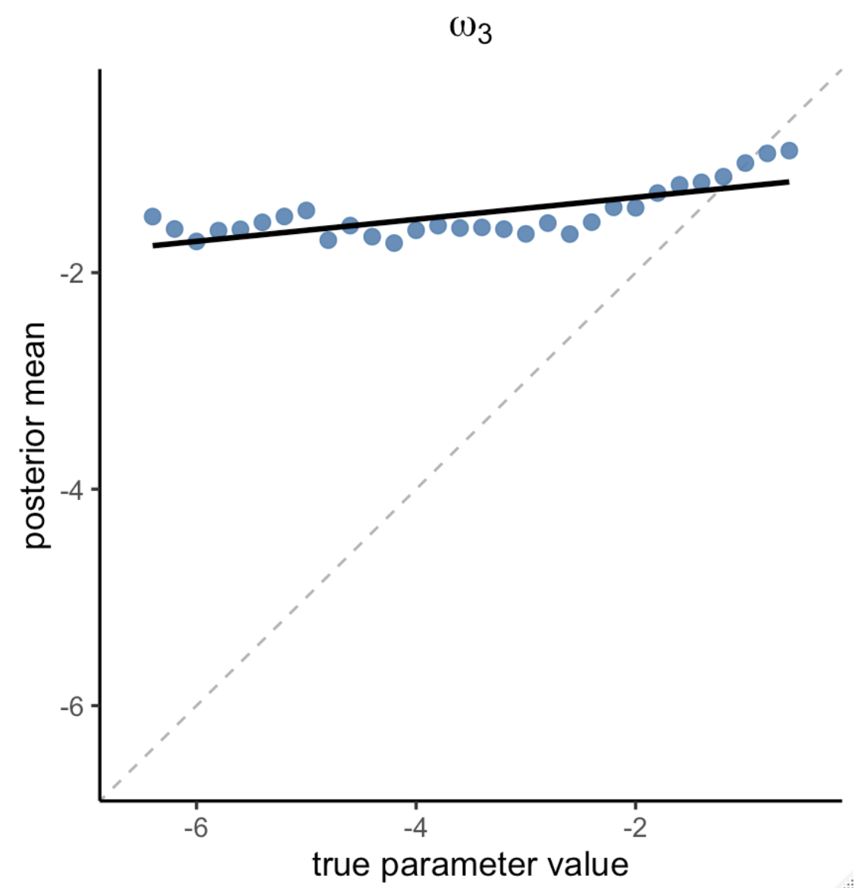

By [**Jinwoo Jeong**](https://www.linkedin.com/in/jinwoo-jeong-ab284420b),
[**Juha Lee**](https://github.com/juhajulia),
[**Yusom Jo**](https://github.com/0150362),
[**Woo-Young Ahn**](https://ccs-lab.github.io/team/young-ahn/) | September 2, 2025

<br />

**Hierarchical Gaussian Filter (HGF)** is a cognitive model designed to explain how individuals learn in uncertain and changing environments [@mathys2011bayesian].
Currently, [TAPAS](https://www.tnu.ethz.ch/de/software/tapas) is the most widely used tool for applying HGF to behavioral data.
By offering various combinations of perceptual and observation models, TAPAS HGF Toolbox enabled computationally efficient way to apply different HGF models.

Over the years, many researchers have requested adding HGF to hBayesDM.
To address such request, hBayesDM `1.3.0` introduces two functions:
[`hgf_ibrb`](../reference/hgf_ibrb.html) and [`hgf_ibrb_single`](../reference/hgf_ibrb_single.html).
Although these functions are currently limited to behavioral data with binary inputs and binary responses,
they provide a straightforward way to apply MCMC and hierarchical Bayesian analysis to HGF models, which are features not supported in TAPAS.

```{r setup, include=FALSE}
knitr::opts_chunk$set(echo = TRUE)
knitr::opts_chunk$set(fig.align = "center")
```

# 1. Example Task

Let us consider a simple probabilistic reversal learning task where HGF can be applied.

On each trial, participants are presented with two colored options—blue(1) and orange(0)—and must choose one.
On any given trial, one of the two options is the correct choice, and participants receive a reward if they select it.
Across the experiment, the probability that blue is the correct option changes over time.
The participant's overall objective is to maximize the cumulative reward.

```{r fig_contingency_schedule, echo=FALSE, out.width="70%", fig.cap="Figure 1. The vertical axis shows the actual reward probability of the blue option p(reward|blue), while the horizontal axis shows the trial number. Since the orange option is simply the alternative, p(reward|orange) is always one minus the value for blue."}
knitr::include_graphics("images/hgf_tutorial/contingency_schedule.png")
```

The figure above illustrates a contingency schedule for a restless two-armed bandit task.
The schedule spans 400 trials, alternating between stable and volatile phases.

- Stable phases (100 trials each): reward probabilities remain fixed. For example, choosing the blue option yields a reward with a probability of 0.8 throughout the first stable block.
- Volatile phases (100 trials each): reward probabilities switch between 0.2 and 0.8 after a random number of trials (6, 10, 14, or 20), making the environment unpredictable.

Probabilistic learning tasks like this are well suited for HGF analysis because the environment changes over time, requiring participants to continuously track shifting reward contingencies.

# 2. Understanding HGF

One way to approach probablistic learning task is to assume a “true” hidden quantity for each trial, such as the actual probability of receiving a reward from the chosen option.
This hidden state changes over time according to the contingency schedule, but the agent cannot observe it directly.
Instead, the agent only observes inputs (whether the chosen option led to a reward) and tries to update its beliefs about the hidden state across trials.
In this sense, the task represents a learning problem under uncertainty: how an agent can keep track of a changing, probabilistic world using only noisy feedback.

Note that there can be various sources of uncertainty:
**stochasticity** (the reward is probabilistic at each trial),
**volatility** (the reward contingency changes over time),
and even **volatility of volatility** (the degree of environmental change itself may vary over time).
Successful task performance therefore depends on the optimal processing of these sources of uncertainty in learning,
and the pattern of such processing can be characterized by the values of the parameters in HGF.

For specific details on HGF, check the original papers [@mathys2011bayesian; @mathys2014hgf].

## 2.1. Model Structure

As the name suggests, the Hierarchical Gaussian Filter consists of multiple levels of hidden states, each organized in a hierarchy and evolving in Gaussian random walks.
Theoretically, the number of hierarchy levels has no upper bound, but in practice it is not set too high due to diminishing explanatory gains and limited interpretability as a cognitive model.

```{r fig_hgf_gaussian_random_walk, echo=FALSE, out.width="70%", fig.cap="Figure 2. Overview of the Hierarchical Gaussian Filter (Mathys et al. 2014)"}
knitr::include_graphics("images/hgf_tutorial/hgf_gaussian_random_walk.png")
```

For instance, let's assume a 3-level HGF with binary inputs and binary responses.
A HGF model with 3 levels has three hidden states for each level: x₁, x₂, x₃.
And each state represents a different aspect of the environment.

- **Level 1 (x₁)** is the lowest level, representing the immediate observation or perceptual state.
  For example, in a binary task, x₁ might be the state of a cue or outcome coded as 0 or 1.
  This level does not evolve via a random walk, instead, it is generated from x₂ through an observation model (e.g., Bernoulli for binary outcomes).
  When there is no sensory noise, x₁ directly corresponds to the observed input.

- **Level 2 (x₂)** is a hidden state that represents the **current contingency of the environment** (e.g., the probability of a binary outcome).
  It can be thought of as the agent's belief about the latent factor governing level-1 events.
  This is a continuous state that drifts over time via a Gaussian random walk: 
  on each trial, x₂ changes slightly, with the variance of this change dictated by level 3 (x₃).

- **Level 3 (x₃)** is a higher-level hidden state representing the **volatility of the environment**, namely how rapidly x₂ changes.
  Although x₃ is modeled as a Gaussian random walk, the variance of this random walk is determined by a constant parameter because there is no higher level to modulate it.
  Intuitively, when x₃ is high, the agent believes the environment is changing rapidly and therefore updates x₂ more strongly;
  when x₃ is low, the agent assumes stability and updates x₂ more conservatively.

```{r fig_hgf_levels, echo=FALSE, out.width="70%", fig.cap="Figure 3. Overview of the hierarchical generative model (Mathys et al. 2011)"}
knitr::include_graphics("images/hgf_tutorial/hgf_levels.png")
```

## 2.2. Perceptual model

In the HGF perceptual model, the parameters κ (kappa) and ω (omega) regulate the coupling and dynamics across hierarchical levels.
They encode the agent's prior assumptions about environmental uncertainty and determine how learning adapts to changing conditions.

At each level $l$, the state $x_l$ at trial $k$ evolves as a Gaussian random walk whose variance depends on κ and ω:

\begin{align*}
x_l^{(k)} &\sim N\bigl(x_l^{(k-1)} \text{, } \exp(\kappa_l x_{l+1}^{(k)} + \omega_l )\bigr), \quad l=2,...L-1 \\
\end{align*}

At the top level $L$, the variance depends only on ω:

\begin{align*}
x_L^{(k)} &\sim N\bigl(x_L^{(k-1)} \text{, } \exp(\omega_L )\bigr)
\end{align*}

### κ: phasic volatility

κ determines how strongly a lower-level state is influenced by the state above it.
Formally, it scales the effect of the higher-level value on the variance of the lower-level random walk.
In a perception model with binary inputs and $L$ hierarchical levels, κ is defined for levels 2 through $L-1$.

κ must be non-negative and it has been suggested that an upper bounds at or below 2 is sensible [@mathys2014hgf].

- When κ is too small, the lower level is almost decoupled from the higher one. 
Even if the higher-level state signals increased volatility, the learning rate at the lower level hardly changes. 
The agent ends up learning at a nearly fixed pace regardless of environmental instability.
- When κ is too large, even small changes in the higher-level state strongly alter the lower-level learning rate.
For instance, if volatility spikes, the agent immediately increases its learning rate. This makes the agent very adaptive, but it can also lead to overreacting to random noise.

### ω: tonic volatility

ω provides the baseline drift for each level's random walk.
It is the constant offset in the log-variance, setting how much the agent expects change even without higher-level modulation.
In a perception model with binary inputs and $L$ hierarchical levels, ω is defined for levels 2 through $L$.

Theoretically, ω doesn't require upper or lower bounds.
However, both [`hgf_ibrb`](../reference/hgf_ibrb.html) and [`hgf_ibrb_single`](../reference/hgf_ibrb_single.html)
requires setting the appropriate range for each level of ω parameters for efficient and effective sampling.

- When ω is too low, the random walk variance is small by default.
  The agent assumes stability, so updates are slow and conservative.
  Even with repeated prediction errors, beliefs change only gradually, reflecting a tendency to cling to prior expectations.
- When ω is too high, the random walk variance is bigger by default.
  The agent assumes that changes are common, so it updates beliefs quickly, even in stable environments.
  This can capture individuals who are highly responsive or prone to “jumping to conclusions.”

## 2.3. Response model

The response model maps the agent's internal prediction onto an observable decision.
In both [`hgf_ibrb`](../reference/hgf_ibrb.html) and [`hgf_ibrb_single`](../reference/hgf_ibrb_single.html),
the unit-square sigmoid function is used to transform a predictive probability 𝑚∈[0,1] into a binary choice probability:

$$
p(y = 1) = \frac{m^{\text{ }\zeta}}{m^{\text{ }\zeta} + (1 - m)^{\zeta}}
$$

### ζ: inverse decision noise

The parameter ζ (zeta) controls the steepness of the unit-square sigmoid, regulating the stochasticity of decision-making.
ζ is defined only for level 1 and must be non-negative.

- When ζ is low, the sigmoid curve becomes shallow.
  Even strong predictions (e.g., 𝑚 = 0.8) yield only moderate choice biases, and choices remain noisy and weakly belief-driven.
- When ζ is high, the sigmoid curve becomes steep.
  Even very small deviations from 0.5 lead to near-deterministic choices, and behavior closely follows the agent's beliefs.

# 3. Tutorial on `hgf_ibrb` and `hgf_ibrb_single`

This section explains how we can actually run [`hgf_ibrb`](../reference/hgf_ibrb.html) and [`hgf_ibrb_single`](../reference/hgf_ibrb_single.html).
The examples are based on `RStan`, but both functions are also implemented in `PyStan` and the same features are implemented.

## 3.1. Setup

### hBayesDM setup

Check the [Getting Started](.//getting_started.html) page to set up `hBayesDM`.

### Prepare your data

For simple tests, `hBayesDM` has example data for both [`hgf_ibrb`](../reference/hgf_ibrb.html)
and [`hgf_ibrb_single`](../reference/hgf_ibrb_single.html).

If you want to apply HGF on your own data, make sure that your file has `.csv` or `.tsv` format and contains these four columns.

- `subjID` : unique subject identifier (integer or string)
- `trialNum` : trial index (1, 2, 3, …)
- `u` : input on that trial (0 or 1)
- `y` : subject's choice on that trial (0 or 1)

## 3.2. Fitting with default settings

Now, we will share various ways we can fit [`hgf_ibrb`](../reference/hgf_ibrb.html)
and [`hgf_ibrb_single`](../reference/hgf_ibrb_single.html) on the example data.

Below is the simplest way to run [`hgf_ibrb`](../reference/hgf_ibrb.html) on dataset with multiple participants.
Below command initiates a MCMC procedure of 4 MCMC chains,
each consisting of 5 burn-in (warm up) iterations followed by 5 sampling iterations.

```{r, eval = FALSE}
fit <- hgf_ibrb(data = "example", niter = 10, nwarmup = 5, nchain = 4)
```

The above command is the same as the commands below
because a default value is set for each argument when not specified.
You should be responsible for setting the appropriate arguments prior to applying HGF on your own dataset.

```{r, eval = FALSE}
fit <- hgf_ibrb(
  data = "example",
  niter = 10, 
  nwarmup = 5, 
  nchain = 4,
  L = 3,
  input_first = FALSE,
  mu0 = c(0.5, 1.0),
  sigma0 = c(0.1, 1.0),
  kappa_lower = c(0),  
  kappa_upper = c(2),
  omega_lower = c(-10, -15), 
  omega_upper = c(0, 0),
  zeta_lower  = 0,
  zeta_upper  = 2
)
```

Below are some of the simple ways to print the overall statistics of the fitted results.

```{r, eval = FALSE}
print(summary(fit))
print(fit$allIndPars)
```
<!-- $ -->

To apply HGF on a single participant data,
[`hgf_ibrb_single`](../reference/hgf_ibrb_single.html) can be used using exactly the same format
with the same arguments.

```{r, eval = FALSE}
fit <- hgf_ibrb_single(data = "example", niter = 10, nwarmup = 5, nchain = 4)
print(summary(fit))
print(fit$allIndPars)
```
<!-- $ -->

## 3.3. `input_first' option

`input_first' option is to help researchers apply HGF without changing their data format.

- input_first=TRUE: for each row, participant observed the input `u` before choosing `y`
- input_first=FALSE: for each row, participant observerd observed `u` after choosing `y` (default)

```{r, eval = FALSE}
fit <- hgf_ibrb(data = "example", niter = 10, nwarmup = 5, nchain = 4, input_first=TRUE)
```

## 3.4. Parameter boundaries

Parameter boundaries can set for each parameters.
For example, the if you want to set parameter boundaries for a 3-level HGF model as:

\begin{align*}
0 \leq &\text{ }\kappa \leq 1 \\
-10 \leq &\text{ }\omega_{2} \leq 2 \\
-15 \leq &\text{ }\omega_{3} \leq 3 \\
0 \leq &\text{ }\zeta \leq 4
\end{align*}

Then, you set the arguments below:

```{r, eval = FALSE}
fit <- hgf_ibrb(
  data = "example",
  kappa_lower = c(0),
  kappa_upper = c(1),
  omega_lower = c(-10, -15),
  omega_upper = c(2, 3),
  zeta_lower  = 0,
  zeta_upper  = 4
)
```

## 3.5. Fixating parameter values

As TAPAS provides a way to fixate a certain parameter to a certain value,
[`hgf_ibrb`](../reference/hgf_ibrb.html) and [`hgf_ibrb_single`](../reference/hgf_ibrb_single.html) also provide similar feature.
To fixate a parameter, simply set the lower bound and upper bound to the same value. Below are some examples.

Below command fixates κ value to 1, while other parameters are estimated with default boundaries.
```{r, eval = FALSE}
fit <- hgf_ibrb(data = "example", kappa_lower = c(1.0), kappa_upper = c(1.0))
```

Below command fixates ω₂ to -4, while ω₃ is still estimated with the given boundaries (-10 < ω₃ < -2).
```{r, eval = FALSE}
fit <- hgf_ibrb(data = "example", omega_lower = c(-4.0, -10.0), omega_upper = c(-4.0, -2.0))
```

In contrast, below command fixates ω₃ to -4, while ω₂ is still estimated with the given boundaries (-9 < ω₂ < -1).
```{r, eval = FALSE}
fit <- hgf_ibrb(data = "example", omega_lower = c(-9.0, -4.0), omega_upper = c(-1.0, -4.0))
```

Below command fixates ζ value to 1, while other parameters are estimated with default boundaries.
```{r, eval = FALSE}
fit <- hgf_ibrb(data = "example", zeta_lower = 1.0, zeta_upper = 1.0)
```

Of course, you can fixate multiple parameters at the same time as below:
```{r, eval = FALSE}
fit <- hgf_ibrb(data = "example", kappa_lower = c(1.0), kappa_upper = c(1.0), zeta_lower = 1.0, zeta_upper = 1.0)
fit <- hgf_ibrb(data = "example", omega_lower = c(-6.0, -4.0), omega_upper = c(-6.0, -4.0))
```

## 3.6. `L`: level of hierarchy

`L` option can be used to specify the level of hierarchy.
The default and the minimum value is `L=3` because it is the most widely used and most interpretable.

Note that the number of parameters are automatically chosen based on the level of hierarchy.
For example, below code will fail because the default arguments for each parameters can only be used for `L=3`.

```{r, eval = FALSE}
fit <- hgf_ibrb(data = "example", niter = 10, nwarmup = 5, nchain = 4, L=4)
```

Below is an example of fitting a 4-level HGF model.
`L=4` introduces a fourth latent state (x₄) and
extends the parameterization with two couplings (κ₂, κ₃), volatilities (ω₂, ω₃, ω₄),
and initial-state vectors for levels 2-4.

```{r, eval = FALSE}
fit <- hgf_ibrb(
  data = "example",
  niter = 10,
  nwarmup = 5,
  nchain = 4,
  L = 4,
  kappa_lower = c(0.0, 0.0),
  kappa_upper = c(3.0, 3.0),
  omega_lower = c(-9.0, -10.0, -12.0),
  omega_upper = c(-1.0,  -2.0,  -3.0),
  mu0    = c(0.0, 1.0, 1.0),
  sigma0 = c(0.1, 1.0, 1.0),
  zeta_lower  = 0.03,
  zeta_upper  = 5.0
)
```

# 4. Parameter Recovery

In order to ensure that the estimated parameters genuinely reflect the underlying generative process,
parameter recovery analysis was conducted to validate model identifiability and estimation reliability.
This procedure involves generating synthetic datasets from known parameter values and then re-estimating those parameters using the same model.

## 4.1. Simulation

In order to simulate binary inputs, the Contingency Schedule from [Section 1](#example-task) was used to create 400 trials of inputs.
To simulate binary responses, `tapas_simModel` function from TAPAS HGF Toolbox was applied to the simulated inputs, assuming 3-level HGF with binary responses.
A total of 30 participant behavioral data was generated using randomly chosen parameter combinations:

\begin{align*}
\kappa &= 1.0 \\
-9.0 \leq &\text{ }\omega_{2} \leq -1.0 \\
-10.0 \leq &\text{ }\omega_{3} \leq -2.0 \\
0.03 \leq &\text{ }\zeta \leq 4.0
\end{align*}

Note that the κ is fixed to 1, following many of the previous works with similar context [@tecilla2023modulation; @hein2021state].

## 4.2. Recovery with TAPAS

In order to check whether the simulated data had reasonable parameter ranges that HGF models can recover, 
`tapas_fitModel` function from TAPAS HGF Toolbox was applied to check parameter recovery.
`tapas_hgf_binary' and `tapas_unitsq_sgm' models were applied using the following prior settings:

\begin{align*}
\mu_{0,2} &= 0, \quad \mu_{0,3} = 1 \\
\sigma^{2}_{0,2} &= 1, \quad \sigma^{2}_{0,3} = 1 \\
\omega_{2} &\sim N(-5, 4^2) \\
\omega_{3} &\sim N(-6, 4^2)
\end{align*}

Figure 4 shows that both ω₂ and ζ were recovered almost perfectly (ω₂: r = 0.99, p < 1.63e-23; ζ: r = 0.99, p < 8.9e-26), 
indicating that these parameters can be reliably estimated at the individual level.
In contrast, ω₃ exhibited almost no recovery (r = -0.09, p = 0.633),
with all the estimated values presumably stuck in a local minima near -6.

```{r fig_tapas_recovery, echo=FALSE, out.width="90%", fig.cap="Figure 4. Parameter recovery in TAPAS. Each panel plots true parameter value - posterior means for ω₂, ω₃, and ζ."}

```

## 4.3. Recovery with `hgf_ibrb_single`

For each subject data, [`hgf_ibrb_single`](../reference/hgf_ibrb_single.html) was applied in a loop with settings as below.

```{r hgf_ibrb_single, eval=FALSE}
fit <- hgf_ibrb_single(data = subject_data,
                       niter = 2000,
                       nwarmup = 1000,
                       nchain = 4,
                       L = 3,
                       kappa_lower = c(1.0),
                       kappa_upper = c(1.0),
                       omega_lower = c(-9.0, -10.0),
                       omega_upper = c(-1.0, -2.0),
                       zeta_lower  = 0.03,
                       zeta_upper  = 4.0,
                       mu0 = c(0.0, 1.0),
                       inits = "random"
)
```

```{r fig_individual_recovery, echo=FALSE, out.width="90%", fig.cap="Figure 5. Parameter recovery (hgf_ibrb_single)"}
knitr::include_graphics("images/hgf_tutorial/individual_recovery.png")
```

Figure 5 shows that both ω₂ and ζ were recovered pretty well (ω₂: r = 0.84, p < 1e-8; ζ: r = 0.94, p < 1e-14),
whereas ω₃ showed almost no recovery with values more scattered compared to TAPAS (r = 0.07, p = 0.71). 

```{r fig_tapas_individual_recovery, echo=FALSE, out.width="90%", fig.cap="Figure 6. TAPAS vs hgf_ibrb_single"}

```

Figure 6 shows that ω₂ and ζ recovery results for `hBayesDM` and TAPAS are positively correlated and have very similar patterns.
In contrast recovery results for ω₃ showed completely different pattern, but it is not meaningful considering that 
they have both failed to recover meaningful parameter values.

Overall, these results indicate that even when each subject is fit independently, `hBayesDM` can be used in much the same way as TAPAS,
while also leveraging the advantages of MCMC sampling such as obtaining posterior distributions of each parameter rather than just point estimates.

## 4.4. Recovery with `hgf_ibrb`

For hierarchical Bayesian analysis, [`hgf_ibrb`](../reference/hgf_ibrb.html) was applied to the 30 participants data as below:

```{r hgf_ibrb, eval=FALSE}
output <- hgf_ibrb(
  data = data,
  niter = 2000,
  nwarmup = 1000,
  nchain = 4,
  L = 3,
  kappa_lower = c(1.0),
  kappa_upper = c(1.0),
  omega_lower = c(-9.0, -10.0), 
  omega_upper = c(-1.0, -2.0),
  zeta_lower  = 0.03,
  zeta_upper  = 4.0,
  mu0   = c(0.0, 1.0),
  inits = "random"
)
```

```{r fig_hierarchical_recovery, echo=FALSE, out.width="90%", fig.cap="Figure 7. Parameter recovery (hgf_ibrb)"}

```

Figure 7 shows that both ω₂ and ζ showed near-perfect recovery (ω₂: r = 0.99, p < 1e-25; ζ: r = 0.95, p < 1e-16),
with better correlation compared to `hgf_ibrb_single`.
Unfortunately, ω₃ still showed poor recovery (r = 0.05, p = 0.79),
but was slightly better than TAPAS considering that the results from TAPAS had a negative correlation.

```{r fig_tapas_hierarchical_recovery, echo=FALSE, out.width="90%", fig.cap="Figure 8. TAPAS vs hgf_ibrb"}
knitr::include_graphics("images/hgf_tutorial/tapas_hierarchical_recovery.png")
```

Figure 8 shows that ω₂ and ζ recovery results for `hBayesDM` and TAPAS matched very closely,
with positively correlations almost near 1.
Once again, recovery results for ω₃ showed completely different pattern with negative correlation,
but it is not meaningful considering that TAPAS have failed to recover meaningful parameter values.

Overall, we can say that `hBayesDM` can be used for fitting HGF models in much the same way as TAPAS,
while additionally enabling hierarchical Bayesian analysis.
Moreover, these results suggest that 
[`hgf_ibrb`](../reference/hgf_ibrb.html) should be preferred over [`hgf_ibrb_single`](../reference/hgf_ibrb_single.html)
as hierarchical modeling framework further improves parameter recovery compared to individual-level fits,
presumably due to the benefits of shrinkage.

# 5. Appendix

## 5.1. Specifying intial values

`hBayesDM` provides various options for the initial values (`inits`) of the parameters.
The default setting is `vb`, therefore `hBayesDM` will try to fit the model with `vb`
and then use the VB estimation as initial values for MCMC sampling. 
If this VB estimation fails, `hBayesDM` defaults to using random initial values instead.

Since the `vb` option has the issue of failing stochastically, considering using the `random` option as below
or specifying the initial parameter values.

```{r init2, eval = FALSE}
fit <- hgf_ibrb(data = "example", inits = "random")
```

## 5.2. Poor recovery of ω₃

During the parameter recovery at [Section 4](#parameter-recovery), both TAPAS and `hBayesDM` have failed to recover ω₃.
Many previous research have also reported unreliable parameter estimation for ω₃ [@reed2020paranoia; @hein2021state; @tecilla2023modulation].
To our knowledge, there has been no systematic analysis on the causes nor the potential solutions for this problem.

To explore this problem, we conducted a few simple experiments,
varying the patterns of inputs and the combinations of fixed and free parameters.
In this page, we'll briefly report some of the results—an input where the simulated behavior differ depending on the value of ω₃,
and the recovery results of (1) when ω₃ is set as the only free parameter and (2) when ω₃ is estimated with other parameters ω₂, ζ.

The model performs parameter estimation based on the participant's behavioral data,
a process known as model inversion. It indicates that, for the model to infer the latent perceptual states from the data,
the data must contain sufficient information for successful inference.
In other words, the effect of the true parameter should be clearly reflected in the data.
	
And this would be dependent on several factors : the task design must elicit the engagement of the parameter of interest
(e.g., the task design must be sufficiently volatile to capture individual differences in volatility estimation).
The parameterization matters too : the model itself should be formalized in a way that changes in parameter values produce noticeable changes in the actual behavior patterns.

To consider these factors, we conducted parameter recovery analyses multiple times using various input designs and different ranges of ω₃
(30 subjects,  -6.4 < ω₃ < -0.8, steps of 0.2).
To check the pure effect of ω₃ on responses, we simulated data with TAPAS (http://www.translationalneuromodeling.org/tapas, version 3.1.0)
in a controlled manner—fix the other parameter values and set seed number to control stochasticity of observation model.
Also, to ensure the changes in ω₃ values were appropriately reflected under input setting, we set the agent with the lowest ω₃ value as baseline agent,
and calculated the total different input numbers with it. If the number varies according to the changes in  ω₃ values,
then it could be said that under the current input setting, the influence of  ω₃ could be reflected on the actual behavioral pattern.
By finding appropriate input with this procedure, we fitted the simulated data with hgf_ibrb, hgf_ibrb_single,
and TAPAS and checked whether the true parameters could be recovered well.

### Simulated input

When simulating with input design introduced on “3. How to implement hgf_ibrb & hgf_ibrb_single - Example data” part,
there were almost **no variability of response** across simulated agents with different ω₃ values.
So we made another input schedule below and checked the response variability depending on ω₃ value.

```{r fig_contingency_schedule_om3, echo=FALSE, out.width="70%", fig.cap="Figure 9. The vertical axis shows the actual reward probability of the blue option p(reward|blue), while the horizontal axis shows the trial number."}
knitr::include_graphics("images/hgf_tutorial/contingency_schedule_om3.png")
```

The overall task design is similar to the the Contingency Schedule from [Section 1](#example-task).
The only different point is that the trial numbers of each stable and volatile phase becomes ½ (both stable and volatile phase consists of 50 trials,
leading to 2 times more frequent shift between stable and volatile phase than previous design introduced in part 3. 

| num_different_responses | subject_ID | omega_3_range | theta_range        |
|-------------------------|------------|---------------|--------------------|
| 0                       | 1–8        | -6.4 – -5.0   | 0.001662 – 0.006738 |
| 1                       | 9–22       | -4.8 – -2.2   | 0.00823 – 0.110803  |
| 2                       | 23         | -2.0          | 0.135335            |
| 3                       | 24         | -1.8          | 0.165299            |
| 4                       | 25         | -1.6          | 0.201897            |
| 6                       | 26         | -1.4          | 0.24659             |
| 8                       | 27         | -1.2          | 0.301194            |
| 9                       | 28         | -1.0          | 0.367879            |
| 18                      | 29–30      | -0.8 – -0.6   | 0.449329 – 0.548812 |


### Simulated input

```{r fig_om3_individual_recovery, echo=FALSE, out.width="40%", fig.show="hold", fig.cap="Figure 10. Parameter recovery"}
knitr::include_graphics("images/hgf_tutorial/om3_individual_recovery.png")

```

### Recommendation for implementing ω₃ estimation
Check if the recovery of ω₃ is good enough in current settings **before conducting experiment**. Considering the factors below would be helpful. 

- Task design

  - Check whether the task design is appropriate for estimating volatility processing.
    Simulate data with the current input design and check whether the simulated responses vary depending on changes in the ω₃ value.
    To test the pure effect of  ω₃ on responses, fix the values of the other parameters and set a random seed to control the stochasticity of the observation model. Defining an index for response variability would be helpful to check the effect of  ω₃ on responses (e.g., set the agent with a small ω₃ as the baseline. Simulate data with various ω₃ values, and calculate the total different response number when comparing with the baseline agent).  

- Boundaries of ω₃ values

  - If ω₃ is too low, then exp(ω₃) becomes very small (e.g., ω₃ = -8, exp(ω₃) ≈ 0.000335),
    which means that level-3 updating has almost no influence on the agent's behavior. Avoid setting the upper bound too low.

- Recovery performance when estimated with other parameters 

  - Evaluate how well ω₃ is recovered when estimated jointly with other parameters.

# References
